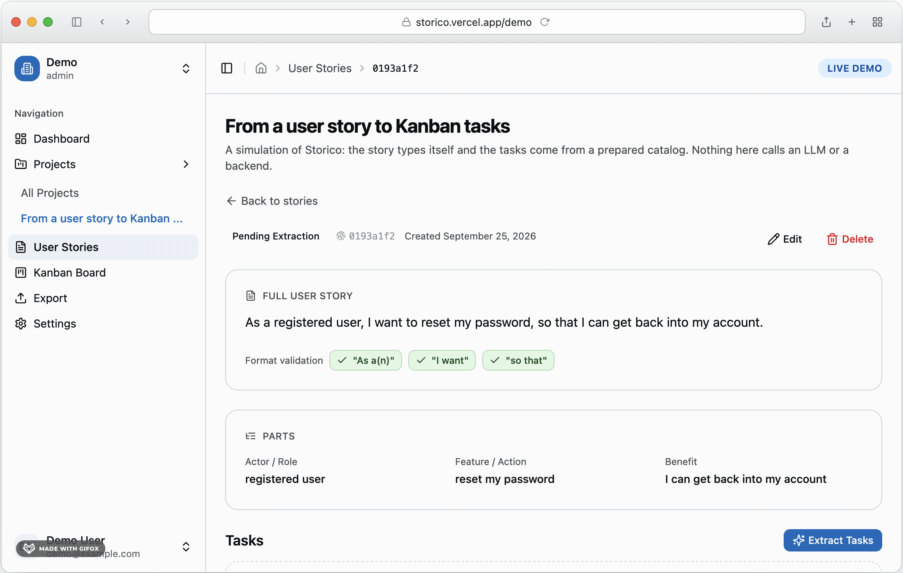

# Storico Live Demo

A static, self-contained simulation of [Storico](https://storico.vercel.app): a
user story types itself out, the "extraction" runs, and the tasks land on the
board, which can be dragged around and exported.

<p align="center">
  
</p>

- **No backend.** No API, no LLM, no keys, no requests. The tasks come from a
  prepared script that ships with the page.
- **No framework runtime.** The page is static markup; the JavaScript only moves
  it between states.
- **The product's design system and shell.** `src/styles/globals.css` is copied
  from Storico's frontend, and the sidebar, header, board, cards, badges and
  buttons reuse its class recipes. See "Provenance" below.

## Commands

```
pnpm install
pnpm dev      # http://localhost:4322 (the product's frontend owns 4321)
pnpm build    # static output in dist/
pnpm preview
```

## Layout

Three views, switched by the sidebar, in the product's own order:

| View | Reproduces | Panel |
| --- | --- | --- |
| Story detail | `StoryDetail.tsx` | `DemoStoryDetail.astro` |
| Kanban board | `KanbanBoard` / `KanbanColumn` / `KanbanCard` | `DemoKanban.astro` |
| Export | `ExportPanel` + `/export` | `DemoExport.astro` |

```
src/
├── components/   AppSidebar, AppHeader, SidebarUserMenu (the product's shell)
│                 DemoViews (the three panels), DemoStoryDetail, DemoKanban,
│                 DemoExport, TaskDialog, Icon
├── data/         types.ts (mirrored from the product), guion.ts (the script),
│                 export.ts (the endpoint's two formats)
├── i18n/         one JSON per locale; the story itself is always English
├── layouts/      DemoLayout: document, theme bootstrap, shell, page framing
├── lib/          icons.ts (generated)
├── pages/        /, /en/, /es/ - all static
├── scripts/      demo.ts: typing, extraction, views, drag & drop, dialogs, export
└── styles/       globals.css, copied from Storico
```

## Provenance

Four things are generated or copied rather than written by hand, because they
have to match the product exactly:

| What | Where it comes from | How to refresh |
| --- | --- | --- |
| `src/styles/globals.css` | `~/Developer/storico/frontend/src/styles/globals.css` at commit `4dcd4fc` | Re-copy the file; its header records the commit and the one deviation |
| `src/lib/icons.ts` | Lucide v0.510.0, the version the product renders | `node scripts/gen-icons.cjs` |
| The product's copy in `src/i18n/*.json` | `~/Developer/storico/frontend/src/i18n/*.json` | `node scripts/gen-i18n.cjs` |
| `src/data/export.ts` | `~/Developer/storico/backend/src/storico/api/routes/export.py` | Re-read the endpoint's two branches |

`src/data/types.ts` mirrors the product's `Task` and `UserStory` shapes, and
`src/data/guion.ts` is the mock story and its decomposition, typed against them.

## Deliberate differences from the product

- **Drag & drop is hand-written** on HTML5 drag events. The product's
  `@hello-pangea/dnd` is ~38 KB gzip and would be the heaviest thing on the page.
  The rules are the product's: the same transitions, the same refusal message.
- **The export shows its content.** The product downloads the file and the
  visitor never sees it; here both formats are rendered and the download is built
  in the browser from what is on screen.
- **The task dialog does not edit.** Title and description are read; only the
  status moves, through the same check as the drag.
- **Inert by design:** Dashboard, Projects, Settings, Edit, Delete and the story
  list. They are buttons, not links, because the app's routes do not exist here
  and a link that 404s is worse than a button that does nothing.
